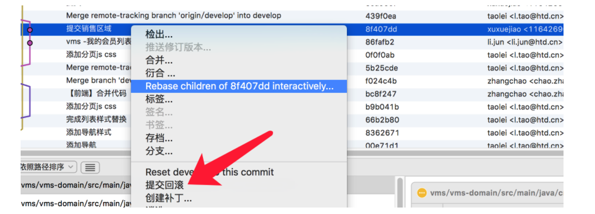
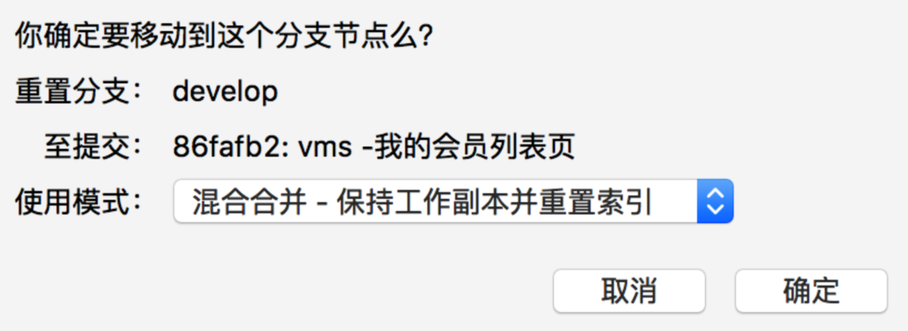
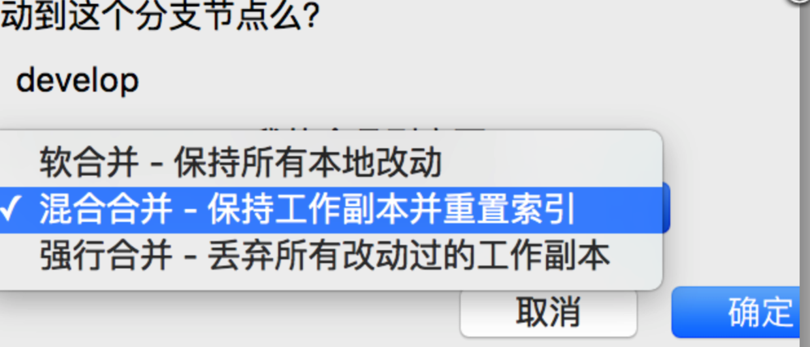
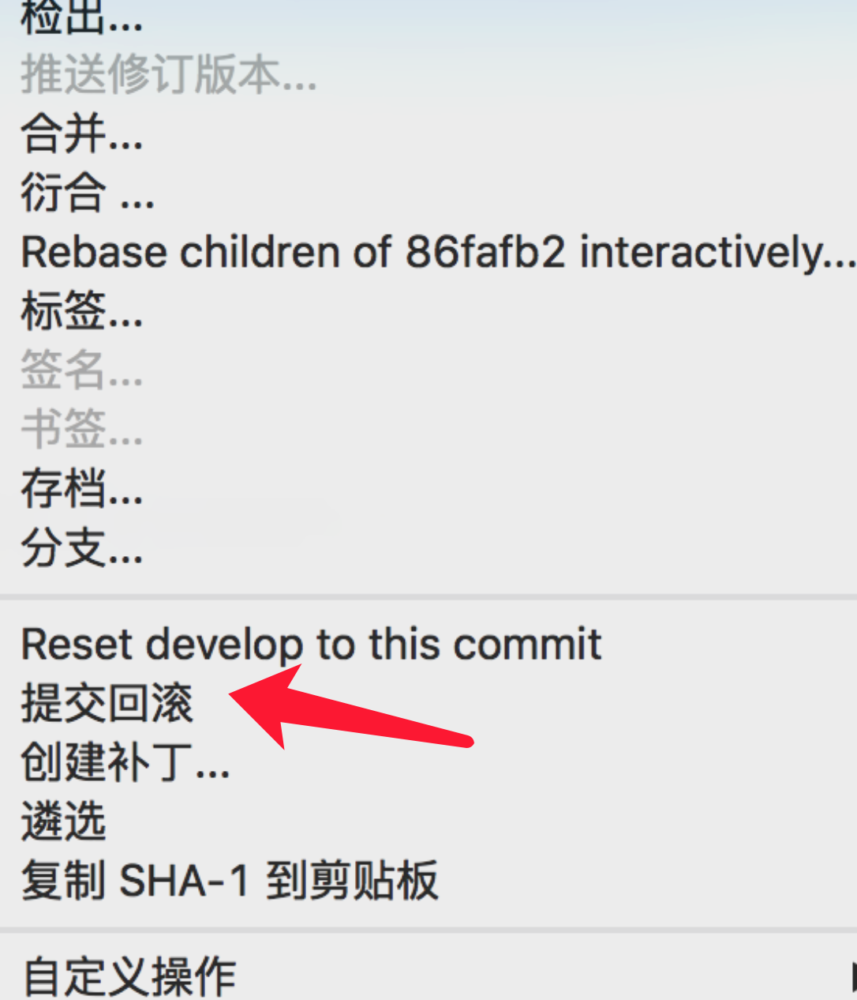

# sourceTreeBackVersion 版本回退

项目开发过程中，代码冲突，是比较麻烦的事情，需要造成冲突的代码作者合作解决。

比冲突更可怕的是冲掉代码，这个时候，就要回滚代码了。

那么git如何回滚代码到某个版本上呢？

1. 使用source tree也可以回滚，选中待回滚的版本，然后点击Reset develop to this commit上

2. 紧接着会弹出如下弹框

3. 里面有三个选项，一定要选择 ：强行合并

4. 然后，再在版本号上选择 提交回滚

5. 最后一步，记得推送一下。

